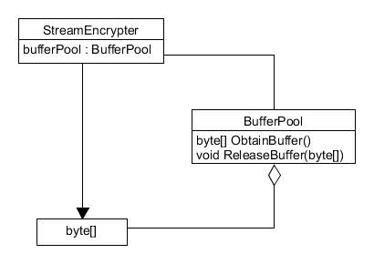

# CS361-DP-collaboration-1

## Что это

Данный проект представляет собой программу для шифровки и расшифровки файлов.
В качестве шифра может быть использован шифр Цезаря или шифр Виженера. Программа
имеет консольный интерфейс. 

## Использование:

\<program name> -c [caesar|vigenere] \<key> [-i \<input file>] [-o \<output file>] 
               [-e|-d] [-t \<number of threads>]
               
где

* \<key> для шифра Цезаря является целым числом между 0 и 255
* \<key> для шифра Вижинера является непустой ascii строкой
* если не было передано \<input file> или \<output file>, то будут использован стандартный поток
* флаги -e и -d определяют желаемую операцию: шифрование или дешифрование
* если не было передано ни -e, ни -d, то будет произведено шифрование

### Демонстрация

Для демострации работы программы могут быть использованы скрипты утилиты из
папки Encrypt/utils. Положите из рядом с фалом программы. Они будут выполнять 
операцию над файлом input.txt в той же папке и записывать результат в файл
output.txt.

## Архитектура

### Общий принцип работы

Программа читает данные из входного файла и разбивает их на блоки одинакого размера.
Размер зависит от выбранного шифра и ключа. Процесс кодирования и декодирования
осуществляется в отдельных потоках. Новый блок помещается в очередь некоторого 
кодирующего потока. Выбор кодирующего потока происходит по кругу, что обеспечивает 
равномерное распределение нагрузки между ними. После того, как блок закодирован/
раскодирован, он отправляется в контейнер блоков готовых для записи в выходной файл.
Записью занимается другой поток. Так как блоки могут попасть сюда в любом порядке, то
для определения их исходного порядка используется дополнительное поле, обозначающее
индекс блока. Это поле позваляет записывать закодированные блоки в той же 
последовательности, в которой они были считаны.

### Используемый порождающий паттерн: пул объектов

Для ограничения используемой памяти в целом и снижения нагрузки на сборщик мусора, 
которая может появиться в связи с потенциально большим количеством потенциально больших
блоков, используется порождающий паттерн пул объектов. 

### Main

Program.Main парсит параметры, создаёт соответствующий им подкласс класса Cipher,
который будет выполнять роль шифратора и дешифратора. Потом создаётся объект 
StreamEncrypter. В конструкторе ему передаётся шифратор и потоки ввода и вывода.
Далее вызывается его метод Encrypt или Decrypt в зависимости от параметров, с 
которыми была запущена программа. Там и происходит основная работа, описанная в
секции "Общий принцип работы".

